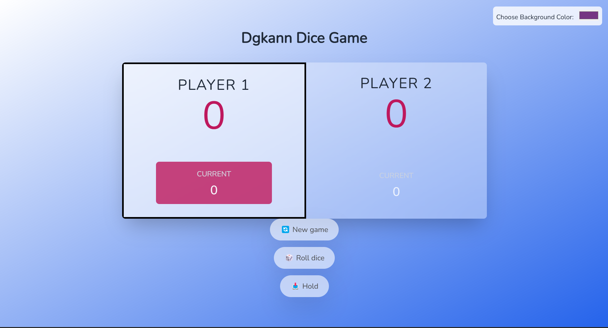

Dgkann Dice Game
================

This is a simple and fun two-player dice game. Players take turns rolling the dice to accumulate points, and the first player to reach 100 points wins the game. The project is developed with a modern and clean interface.

How to Play
-----------

The goal of the game is to be the first to reach **100 points**.

1.  **Roll the dice:** The current player clicks the "Roll dice" button. The rolled number is added to the player's "CURRENT" score.
    
2.  **Hold:** The player can click the "Hold" button to add their "CURRENT" score to their main score and pass the turn to the opponent.
    
3.  **Watch out!:** If the player rolls a **1**, their "CURRENT" score is reset, and the turn immediately passes to the other player.
    
4.  **New Game:** The "New game" button resets all scores and starts the game over.
    
5.  **Personalization:** You can change the background color of the game using the color picker in the top-right corner.
    

Features
--------

*   Two-player gameplay
    
*   Turn-based point accumulation
    
*   Tracking of current round and total scores
    
*   Game objective to reach 100 points
    
*   Game reset functionality
    
*   User ability to change the background color
    

📸 Screenshot
-------------

### Main Page

Tech Stack
----------

*   **HTML:** For the basic structure of the page.
    
*   **CSS:** For basic styling and visual adjustments.
    
*   **Tailwind CSS:** A utility-first CSS framework for rapid UI development.
    
*   **JavaScript:** For all the game logic, interactions, and dynamic features.
    

Setup
-----

This project does not require any server or build process.

1.  Download or clone the project files to your computer.
    
2.  Open the index.html file in your favorite web browser by double-clicking it.
    
3.  Start playing!

## Developers

- [Doğukan Yurtturk](https://github.com/dgkann)  